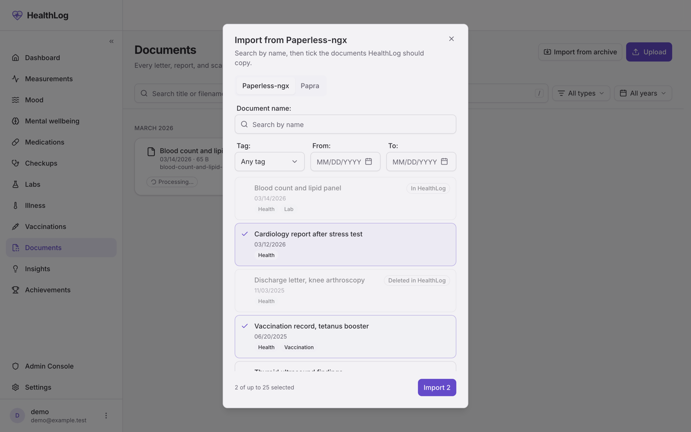

The [document vault](/guides/document-vault/) can take documents from another
document system without you uploading them one by one. There are three ways
in:

- **The document picker** (since v1.39.3) searches your Paperless-ngx or Papra
  from inside HealthLog. You look a document up by name, narrow by tag or
  date, tick what you want, and HealthLog copies it. Use it for the letter you
  need now, from the visit or vaccination it belongs to.
- **A Paperless-ngx workflow** (since v1.39.2) sends each newly tagged
  document to HealthLog by itself. Use it for documents that arrive from now
  on.
- **The import script** (since v1.39.2) copies documents from Paperless-ngx or
  Papra in one go. Use it for the archive you already have, and, run on a
  schedule, to keep Papra in step.

The workflow and the script push into HealthLog with a **document token**;
HealthLog holds nothing for them. The picker is the one way HealthLog itself
connects to your archive: you store an API token for it in Settings, and
HealthLog uses it only while you search, test or import. Nothing syncs in the
background, and there is no watched mail box or folder.

HealthLog keeps its own encrypted copy of each document. The preview, text
search, the lab import, the doctor report and sharing all need the file
itself, so it does not link to a file stored elsewhere. An imported archive
therefore takes space in both systems, and the copy does not follow later
edits or deletions in the source.

## Before you start

- HealthLog v1.39.2 or later for the workflow and the script, v1.39.3 or later
  for the picker.
- For the picker: the server's administrator has listed your archive's
  address in `DOCUMENT_SOURCE_ORIGINS` (see
  [environment variables](/reference/environment-variables/#documents-optional)).
  Without it the Document archives card does not appear.
- The **Documents** module turned on under **Settings → Modules**. Uploads are
  refused while it is off.
- For the workflow: Paperless-ngx 3.0 or later, the first release with the
  `{{doc_id}}` placeholder.
- For the script: Node 22 on any machine that can reach both systems (or
  Docker, see below), and Paperless-ngx 2.16 or later or a current Papra.

## Pick documents inside HealthLog

Since v1.39.3. Needs Paperless-ngx 2.16 or later, or a current Papra.

### Connect your archive

Open **Settings → Integrations** and find the **Document archives** card.
Choose **Paperless-ngx** or **Papra**, then fill in:

- **Address**: where your archive runs, for example
  `https://paperless.example.com`, or with a path if it is served under one
  (`https://example.com/paperless`). Below the field the card lists the
  addresses this server allows; an address that is not on that list is
  refused.
- **Organization id** (Papra only): the part after `/organizations/` in the
  Papra address bar. It looks like `org_` followed by 24 letters and digits.
- **API token**: in Paperless-ngx under **My Profile → API token**; in Papra an
  API key with `documents:read` and `tags:read`. Saving checks both
  permissions.

Select **Save and test**. HealthLog asks your archive once before it saves
anything, so a wrong token or address is reported here and not on your first
search. The token is stored encrypted and never shown again; the field then
says **Saved for this address. Leave empty to keep it.** You can change the
path or the Papra organization without typing the token again. Moving to
another server asks for it again, because HealthLog only ever sends a token to
the address it was saved for. **Test** checks the saved connection, and
**Disconnect** makes HealthLog forget address and token (documents you already
imported stay).

### Find and import

An **Import from Paperless-ngx** (or **Import from Papra**, or **Import from
archive** when both are connected) button appears wherever you add or link
documents:

- on the **Documents** page, beside **Upload**;
- in a visit and a vaccination, beside **Add** in the documents block;
- on a condition, in its documents card.

The sheet opens with the **Document name** field ready. Type part of the
document's name (its title in Paperless-ngx; in Papra the search is Papra's
own); **Tag**, **From** and **To** narrow the list. Each row shows the
document's date, size (Papra), tags, and whether HealthLog already has it:

- **In HealthLog**: imported earlier. From the Documents page it cannot be
  picked again; from a visit, vaccination or condition it can, and picking it
  links the copy you already have.
- **Deleted in HealthLog**: you deleted it here, so it is not offered again.

Tick up to 25 documents and select **Import** (the button shows how many).
They are copied one at a time; each row says whether it was imported, was
already there, or why it was not. If something will fail for every document
(the hourly upload limit, full storage, a refused token) the run stops and says
so.



Opened from a condition, the imported documents are linked to it at once. In a
visit or vaccination form they join the form's selection and are linked when
you save the form. From a vaccination they are filed as **Vaccination**
documents; everywhere else as **Other**, which you can change on the document.

On a Paperless-ngx that keeps its data in SQLite, the name search ignores case
only for plain ASCII letters (`röntgen` does not find `Röntgen`). That is
Paperless-ngx's own search.

### What the picker does and does not do

- It contacts your archive only while you search, filter, test or import.
  Nothing polls, and nothing is copied that you did not tick. A search waits
  up to 10 seconds for the archive, a file up to 60.
- Imports use the same rules as the script and the workflow: a document
  already in HealthLog is not stored twice, a document you deleted stays
  deleted, and the upload limit (60 an hour, shared with your own uploads) and
  your storage quota apply. Searches, tag lists, tests and imports together
  are limited to 60 requests a minute.
- A picked document follows your **Read documents automatically with AI**
  setting, like a document you upload yourself. (The script holds AI reading
  back by default because it may copy thousands of files at once.)
- Only you can use your connection, and only in the browser. People you share
  your record with, at any level, do not see the picker, and it is not
  available in the iOS app.
- The connection is not part of backups. After a restore on another server,
  connect again. **Delete all data** and deleting the account remove it.
- If Documents is switched off, or the administrator unsets
  `DOCUMENT_SOURCE_ORIGINS`, the card stays in Settings with only
  **Disconnect**, so you can still remove the saved token. If only your
  archive's address is taken off the list, the card says so, **Test** is
  unavailable, and you can save another allowed address.

## Create a document token

Open **Settings → API & Tokens → Document tokens**, name the token after
where it will live (for example "Paperless workflow" or "Import script") and
select **Create**. Copy the token straight away: it starts with `hlk_`, is shown
**once**, and is stored only as a hash, so no page can show it again. If you
lose it, create another and revoke the old one.

A document token can add documents to **your own** vault through two
requests: the upload, and a lookup that says whether a document from the
source is already there. That is all. It cannot list, open, download, change
or delete a document, reach any AI feature, or create another token. When it
uploads, the answer says only whether the file was stored, never the title,
the type or anything else about your vault.

- **Lifetime.** A year. The token then stops working; create a new one and
  paste it where the old one was.
- **Revoking.** Every token, document tokens included, is listed under
  **API Tokens** further down the same page, with `documents:write` in the
  permissions column. Revoking takes effect at once.
- **Limits.** Ten live document tokens per account; the eleventh is refused
  until you revoke one. Creating a token needs a browser session, and it is
  refused while the operator has switched the API off under Admin.

Give each system its own token. Each token has its own hourly upload
allowance, and a revoked token then stops only the system it belonged to.

## New documents from Paperless-ngx

In Paperless-ngx, open **Workflows** and add a workflow.

**Triggers.** Add a **Document Added** trigger and a **Document Updated**
trigger. On each, add the filter **Has any of these tags** and choose the tag
you use for health documents, for example `HealthLog`. With both triggers, a
document is sent when it arrives already tagged and when you tag it later.

**Action.** Add a **Webhook** action:

| Field                             | Value                                                            |
| --------------------------------- | ---------------------------------------------------------------- |
| Webhook url                       | `https://health.example.com/api/documents/inbound`               |
| Use parameters for webhook body   | on                                                               |
| Send webhook payload as JSON      | off                                                              |
| Webhook params                    | the parameters below                                             |
| Webhook headers                   | `Authorization` = `Bearer hlk_…` (your document token)           |
| Include document                  | on                                                               |

| Parameter      | Value                                                |
| -------------- | ---------------------------------------------------- |
| `title`        | `{{doc_title}}`                                      |
| `documentDate` | `{{created_year}}-{{created_month}}-{{created_day}}` |
| `sourceSystem` | `PAPERLESS`                                          |
| `sourceId`     | `{{doc_id}}`                                         |
| `sourceInstance` | `https://paperless.example.com` (the address of your Paperless-ngx) |

Since v1.39.3 `sourceInstance` tells HealthLog which Paperless-ngx the id
belongs to, so document 12 on one instance and document 12 on another stay
apart. Only its origin counts (a path is dropped), and it is accepted only
together with `sourceId`. Leave it out and the id matches any Paperless-ngx,
which is how everything imported with v1.39.2 is treated.

Paperless then posts the original file together with these fields as a form,
which is what HealthLog expects. Use the address HealthLog is actually served
at: Paperless does not follow redirects, so an `http://` address that
redirects to `https://` fails.

Two optional parameters:

- `kind`: one of `DOCTOR_REPORT`, `DISCHARGE_LETTER`, `LAB_RESULT`,
  `IMAGING`, `PRESCRIPTION`, `REFERRAL`, `INSURANCE`, `VACCINATION` or `OTHER`,
  if this workflow only ever sends one type of document. Without it a document
  is filed as **Other** and you can change the type in HealthLog.
- `aiRead` with the value `defer`, if you do not want new documents read by
  your AI provider as they arrive. See [AI reading](#ai-reading-of-imported-documents).

Tagging a document again or editing it in Paperless fires the workflow again.
HealthLog recognises the Paperless document id and answers that it already has
it, so no second copy is made, and a document you deleted in HealthLog is not
brought back. Each re-send still carries the whole file, so it counts towards
the token's [hourly upload limit](#limits-and-storage).

:::caution[Not for the archive]
Paperless gives up on a webhook after three retries a few seconds apart, and
does not retry at all when a request takes longer than five seconds. Tag
hundreds of documents at once and most of those webhooks arrive while
HealthLog is asking for a pause (see [Limits](#limits-and-storage)), so
Paperless drops them. Copy the existing archive with the script and let the
workflow handle what comes after. The two work together: documents the script
already copied are recognised when the workflow sends them.
:::

## The existing archive: the import script

The script is one file, `scripts/import-documents.mjs` in the HealthLog
repository, with no dependencies. It runs wherever you are, not inside the
HealthLog container. Download it:

```sh
curl -O https://raw.githubusercontent.com/MBombeck/HealthLog/main/scripts/import-documents.mjs
```

Credentials go in environment variables, never on the command line, where
they would end up in your shell history:

```sh
export HEALTHLOG_TOKEN=hlk_…   # the document token
export PAPERLESS_TOKEN=…       # Paperless-ngx: My Profile → API Auth Token
export PAPRA_TOKEN=…           # Papra: an API key with documents:read (and tags:read for --tag)
```

The script reads whatever the Paperless-ngx user or the Papra API key can see,
so filter with `--tag`.

### Paperless-ngx

```sh
node import-documents.mjs paperless \
  --paperless-url https://paperless.example.com \
  --healthlog-url https://health.example.com \
  --tag HealthLog
```

The Paperless token is sent as `Authorization: Token …`, and the script asks
for API version 9, which Paperless-ngx 2.16 and later speak. The tag name is
matched without regard to case.

### Papra

```sh
node import-documents.mjs papra \
  --papra-url https://papra.example.com \
  --papra-org <organization id> \
  --healthlog-url https://health.example.com \
  --tag Health
```

The organization id is in the Papra address bar, `/organizations/<id>/…`. The
API key is sent as `Authorization: Bearer …`.

### Without Node

Run it in a throwaway container from the folder the script is in:

```sh
docker run --rm -it -v "$PWD:/w" -w /w \
  -e HEALTHLOG_TOKEN -e PAPERLESS_TOKEN \
  node:22-alpine node import-documents.mjs paperless \
  --paperless-url https://paperless.example.com \
  --healthlog-url https://health.example.com --tag HealthLog
```

For Papra, pass `-e PAPRA_TOKEN` instead of `-e PAPERLESS_TOKEN`.

### Options

| Option                    | What it does                                                                                                                                                                             |
| ------------------------- | ---------------------------------------------------------------------------------------------------------------------------------------------------------------------------------------- |
| `paperless` or `papra`    | The source. Always first.                                                                                                                                                                |
| `--healthlog-url <url>`   | Your HealthLog address. Or set `HEALTHLOG_URL`.                                                                                                                                          |
| `--paperless-url <url>`   | Paperless-ngx address. Or `PAPERLESS_URL`.                                                                                                                                               |
| `--papra-url <url>`       | Papra address. Or `PAPRA_URL`.                                                                                                                                                           |
| `--papra-org <id>`        | Papra organization id. Or `PAPRA_ORG`.                                                                                                                                                   |
| `--tag <name>`            | Only documents with this tag. Recommended.                                                                                                                                               |
| `--since YYYY-MM-DD`      | Only documents dated on or after this day.                                                                                                                                               |
| `--kind <KIND>`           | File everything as this type (the values listed under the workflow above).                                                                                                               |
| `--kind-map "A=KIND,B=KIND"` | Choose the type by Paperless document type or by Papra tag name, for example `--kind-map "Befund=DOCTOR_REPORT,Labor=LAB_RESULT"`. Anything unmatched gets `--kind`, or **Other**. |
| `--dry-run`               | List what would be copied, with sizes and a total. Sends nothing.                                                                                                                        |
| `--ai-read`               | Let HealthLog read the documents with AI as they arrive. Off by default.                                                                                                                 |
| `--help`                  | Print the options.                                                                                                                                                                       |

### Try it first with a dry run

```sh
node import-documents.mjs paperless --paperless-url https://paperless.example.com \
  --tag HealthLog --dry-run
```

A dry run only talks to the source, so it needs neither `HEALTHLOG_TOKEN` nor
`--healthlog-url`. It prints one line per document (date, type, size, source
id and title) and a total, which you can hold against your
[storage limit](#limits-and-storage). Because it does not ask HealthLog, it
also lists documents HealthLog already has; the real run skips those.

### What gets copied

For each document the script sends the original file (for Paperless the
original upload, not the archived PDF), the title, the document date, the
type if you chose one, and the source id. It works on one document at a time
and holds one file in memory.

- **Title.** The source's title, else its file name without the extension,
  else "Paperless 123" or "Papra abc". Cut to 200 characters.
- **Date.** The date the source holds for the document. When it has none, the
  day the document was added there; when it has neither, the day of the
  import. The summary lists every such document so you can correct its date
  in HealthLog.
- **Where it came from.** The document's detail sheet in HealthLog shows
  **Imported from Paperless-ngx · ID 123** (or Papra), so you can find it in
  the other system.

### The output

Each document gets one line:

```text
Importing documents from Paperless-ngx tagged "HealthLog".
  imported  Paperless-ngx 412 "Blood test March"
  present   Paperless-ngx 413 "Discharge letter"
  deleted   Paperless-ngx 415 "Old referral" (you deleted it in HealthLog; left alone)
  skipped   Paperless-ngx 418 "Scan": HealthLog does not accept this file type
  … HealthLog asked to slow down, waiting 1740 s

Imported: 1
Already in HealthLog: 1
Deleted in HealthLog, left alone: 1
Skipped: 1
  Paperless-ngx 418 "Scan": HealthLog does not accept this file type
```

`present` means HealthLog already has the document, `deleted` that you
deleted it there. A `skipped` document was not copied and the reason follows;
the run carries on. When it has to stop, the script still prints the summary
and then a line starting with `Stopped:` on standard error.

| Exit code | Meaning                                                                                                                             |
| --------- | ----------------------------------------------------------------------------------------------------------------------------------- |
| `0`       | Everything was imported, already there, or deleted by you.                                                                          |
| `3`       | The run finished, but some documents were skipped. They are listed in the summary.                                                  |
| `1`       | The run stopped: a refused token, the vault switched off, storage full, a missing tag, or a service that could not be reached.      |
| `2`       | A mistake in the command, such as a missing source, an unknown option, a malformed date or an unknown type. Nothing was contacted. |

## Running it again, duplicates and deletions

Running the script again is safe, and so is an interrupted run: it simply
picks up where it stopped.

- **Documents already copied** are recognised by the source system plus the
  source's document id. Before downloading a document, the script asks
  HealthLog whether it has it, so a known document is neither downloaded nor
  sent again, and a re-run over a large archive is quick. These checks count
  towards the lookup allowance, not the upload allowance (see
  [Limits](#limits-and-storage)).
- **A file you had already uploaded by hand** is recognised by its content:
  the import answers "already there", stores no second copy and remembers the
  source id for that document from then on. Because the file has to be sent
  for the content to be compared, this first match counts as one upload. One
  document can collect up to 20 such extra ids; the file under a 21st id is
  refused and listed as skipped (`409`, see [Troubleshooting](#troubleshooting)).
- **Deleted documents stay deleted.** If you delete an imported document in
  HealthLog, neither the script nor the Paperless workflow brings it back,
  also after the 30-day undo window when HealthLog removes it for good. The
  same holds for a hand-uploaded document the import had matched by content.
  If you undo the delete within the 30 days, the document counts as present
  again. During those 30 days a deleted document is also recognised by its
  content, so the same file from another archive or under a new id is not
  stored again. After the purge HealthLog remembers the ids, not the content.
- **Which instance.** From v1.39.3 the script also sends the address of the
  Paperless-ngx or Papra it reads from, and the picker records it. Documents
  imported before that carry no address and still count as already there, or
  as deleted, whichever instance you import from.

Two things reset that memory, because both start the record over. **Delete
all data** under Data & Privacy forgets which imported documents you had
deleted, and a restore from a backup does not carry it either (a backup
carries only live documents). A later import can then bring such a document
back, and you delete it again. A file you uploaded by hand and deleted before
any import met it has no source id to remember, so an import stores it again.

## AI reading of imported documents

If you have turned on **Read documents automatically with AI**, HealthLog
normally reads each new document with your AI provider as it arrives. For an
import the script holds that back by default, so an archive does not turn into
a thousand AI requests at once. Imported documents still get a preview, and a
PDF with a text layer is searchable by its words; neither leaves your server.

The hold is remembered per document: turning on automatic reading later does
not send these documents to your provider either. To have them read:

Open the document and choose **Read with AI**, which reads it with your
provider, makes a scan or photo searchable and, with Labs on, offers any lab
values for review. **Generate summary** writes the stored summary. Either ends
the hold for that document. These actions share the per-person document-AI
limit (six an hour by default, set by the operator with
`DOCUMENT_AI_LIMIT_PER_HOUR`).

**Index all for search** on the Documents page leaves held-back documents
alone, so it is not a way to read an imported archive in bulk. A scanned
document without a text layer stays unsearchable until you choose **Read with
AI** on it. If you want an archive of scans read as it arrives, pass
`--ai-read` instead: every imported document is then read like any other
upload, within your daily AI budget. The Paperless workflow does not hold
reading back unless you add the `aiRead` parameter.

## Limits and storage

- **Uploads per hour.** A document token may send 120 uploads an hour by
  default, so an archive of a thousand documents takes a night. Every upload
  that sends a file counts, including one HealthLog answers as already stored
  (a Paperless re-send, for instance). The limit is per token, and uploads you
  make yourself in the web app or on your phone are counted separately and are
  not held up. The operator can change it with
  [`DOCUMENT_UPLOAD_LIMIT_PER_HOUR`](/reference/environment-variables/#documents-optional).
- **Lookups.** The script asks before each download whether HealthLog already
  has the document, and a document it recognises this way sends no file and
  does not count as an upload. These questions are limited to 5,000 an hour
  per token, which covers a re-run over a few thousand documents. When they
  are spent, the script does not wait: it downloads and uploads the document,
  and HealthLog still recognises it by its source id, at the cost of one
  upload.
- **Waiting.** When an upload, Paperless-ngx or Papra answers `429`, the
  script waits for as long as the `Retry-After` header says (at most an hour
  per wait) and carries on, as often as it takes. A server error or a dropped
  connection is retried three times, after 5, 15 and 45 seconds.
- **Storage.** The default limit is 1 GB per person, counting deleted
  documents until they are removed for good 30 days later. A dry run shows
  what an import needs. An admin can raise the limit in the admin area, for
  everyone or for one account. When storage runs out the script stops; raise
  the limit and run it again.
- **File size and type.** A file over the per-file limit (25 MB by default)
  or of a type the vault refuses is skipped and named in the summary. The
  [vault's format table](/guides/document-vault/#what-it-stores--and-how-it-is-served)
  lists what is accepted.

## Keep it in step on a schedule

Papra cannot post into HealthLog directly: its webhooks announce that a
document changed but carry neither the file nor a header for a token. Run the
script on a schedule instead. The same works for Paperless if you prefer it to
the workflow. A nightly run adds only what is new.

With cron, keep the tokens in a file only you can read:

```sh
# /opt/healthlog-import/env (chmod 600)
HEALTHLOG_TOKEN=hlk_…
PAPRA_TOKEN=…
```

```text
15 3 * * * cd /opt/healthlog-import && set -a && . ./env && set +a && node import-documents.mjs papra --papra-url https://papra.example.com --papra-org <id> --healthlog-url https://health.example.com --tag Health --since 2026-01-01 >> import.log 2>&1
```

With a systemd timer:

```ini
# /etc/systemd/system/healthlog-import.service
[Service]
Type=oneshot
WorkingDirectory=/opt/healthlog-import
EnvironmentFile=/opt/healthlog-import/env
ExecStart=/usr/bin/node import-documents.mjs papra --papra-url https://papra.example.com --papra-org <id> --healthlog-url https://health.example.com --tag Health --since 2026-01-01
```

```ini
# /etc/systemd/system/healthlog-import.timer
[Timer]
OnCalendar=*-*-* 03:15
Persistent=true

[Install]
WantedBy=timers.target
```

Enable it with `systemctl enable --now healthlog-import.timer`; the output
lands in `journalctl -u healthlog-import`. With Paperless, `--since` narrows
the list on the Paperless side; with Papra the script still reads the full list
but does not look up or download anything older.

## Troubleshooting

| What the script prints                                                                  | What to do                                                                                                                                                                              |
| --------------------------------------------------------------------------------------- | --------------------------------------------------------------------------------------------------------------------------------------------------------------------------------------- |
| `The document vault is switched off in HealthLog.`                                      | Turn on **Documents** under **Settings → Modules** and run it again.                                                                                                                    |
| `HealthLog refused the request (403). Use a document token …`                           | The token is not a document token (a measurement token, for instance), or HealthLog is older than v1.39.2. Create a document token.                                                     |
| `HealthLog refused the token (401).`                                                    | The token is mistyped, revoked or expired. Create a new one.                                                                                                                            |
| `Your HealthLog storage is full.`                                                       | HealthLog answered `413`: the storage limit is reached. Delete documents (the space returns after the 30-day undo window) or have an admin raise the limit, then run again.              |
| `… HealthLog asked to slow down, waiting … s`                                           | Not an error: the token's hourly upload limit is reached (`429`). Let it run; the operator can raise `DOCUMENT_UPLOAD_LIMIT_PER_HOUR`.                                                   |
| `The HealthLog address redirects to …`                                                  | Use the address it names with `--healthlog-url`, usually the `https://` one.                                                                                                             |
| `Paperless-ngx has no tag named "…"` / `Papra has no tag named "…"`                     | Check the spelling. For Papra, the API key also needs `tags:read`.                                                                                                                      |
| `Paperless-ngx refused the token (403)` / `Papra refused the token (401)`               | The source token is wrong or lacks permission. For Papra, the key needs `documents:read`.                                                                                               |
| `Paperless-ngx answered 406 for …`                                                      | Paperless-ngx is older than 2.16 and does not speak API version 9. Update it.                                                                                                           |
| `… could not connect (…)`                                                               | The address is unreachable from where the script runs; it retried three times first.                                                                                                     |
| `skipped … larger than HealthLog accepts (25.0 MB)`                                     | The file is over the per-file limit. An admin can raise it up to 100 MB; run again afterwards.                                                                                          |
| `skipped … HealthLog does not accept this file type`                                    | The vault refuses the format. Convert it to PDF in the source, or leave it there.                                                                                                       |
| `skipped … HealthLog answered 409: This file is already stored under too many source ids.` | The same file already carries 20 extra source ids in HealthLog. Nothing was stored. Usually the source holds the same file many times; clean it up there. |
| `skipped … HealthLog answered 500`                                                      | A server error that persisted through three retries. Run again later; the document is picked up then.                                                                                  |
| `HEALTHLOG_TOKEN is not set.` and similar                                               | Exit code `2`: export the variable, or pass the missing option.                                                                                                                         |

Once HealthLog has refused one file as too large, the script skips every
further document whose size the source already reports as larger, without
downloading it. Sizes under 0.1 MB are printed in KB.

### Messages in the picker

| What the picker says | What to do |
| --- | --- |
| This address is not on the server's list of allowed archives. | The administrator has to add its origin to `DOCUMENT_SOURCE_ORIGINS`. The card shows the allowed addresses under the Address field. |
| The archive redirected the request. | HealthLog never follows a redirect. Enter the address the archive redirects to, usually `https://` instead of `http://`, or with or without a trailing path. |
| The archive's answer could not be read. | The address most likely points at a login page or a proxy instead of the archive itself. |
| The archive is too old. | Paperless-ngx 2.16 or later is needed (API version 9). |
| The Papra key cannot read tags. | Give the key the `tags:read` permission and save again. |
| The archive refused the token. | Check the token and its permissions (`documents:read` and `tags:read` for Papra). |
| Too many requests. Wait a minute and try again. | Searches, tag lists, tests and imports share a limit of 60 a minute. |

### The Paperless workflow

For the Paperless workflow there is no summary: a failed webhook appears in
the Paperless-ngx log. The usual causes are a mistyped header (it must read
`Bearer hlk_…`), the Documents module being off, **Send webhook payload as
JSON** switched on, **Include document** switched off, or an address that
redirects. If HealthLog runs on a private address, the Paperless-ngx setting
`PAPERLESS_WEBHOOKS_ALLOW_INTERNAL_REQUESTS` must not be `false`.

## Writing your own importer

Anything that can send a multipart form can use a document token. The upload
is `POST /api/documents/inbound` with the file in a field named `file` and
optional `title`, `kind`, `documentDate` (`YYYY-MM-DD`) and `aiRead=defer`.
The source key, `sourceSystem` plus `sourceId`, can travel as form fields or in
the query string, or both; if both are sent they must agree.

- **As form fields**, the key is checked after the upload has been counted,
  so a known key costs one upload. This is what the script sends.
- **In the query string**, HealthLog answers a known key before the file is
  read and without counting an upload, but the check draws on the lookup
  allowance: once that is spent, the upload is refused with `429` as well,
  even with uploads left.

Details:

- `sourceSystem` is one of `PAPERLESS`, `PAPRA` or `OTHER`. Use `OTHER` for
  anything else. `OTHER` is one shared set of ids per account: if you push from
  two other systems, make their ids distinct, for example `nextcloud-123` and
  `scanner-123`.
- `sourceId` is up to 128 printable characters without spaces.
- `GET /api/documents/inbound/source?sourceSystem=…&sourceId=…` answers
  `{ "known", "id", "deleted" }` without an upload, which is what the script
  asks before each download.
- A token upload answers with a receipt, not the stored document: `201` with
  `{ "id", "duplicate": false }` for a new document, `200` with
  `"duplicate": true` for one already there, and `200` with `"deleted": true`
  added for one you deleted. `409` with `documents.inbound.sourceAliasLimit`
  means the same file already carries 20 extra source ids; nothing is stored.
- Every upload whose file is read counts towards the hourly upload limit,
  duplicates included. Only a known key in the query string, or a separate
  lookup, avoids that. Past the limit the answer is `429` with
  `documents.inbound.rateLimited` and a `Retry-After` header.
- Send one upload at a time. While two uploads for the same account are
  already in progress, a third is refused with `429`,
  `documents.inbound.uploadBusy` and `Retry-After: 1`.
- `413` with `meta.reason: quotaExceeded` means the storage limit is reached;
  `fileTooLarge` means the file is over the per-file limit. `415` is a file
  type the vault refuses.

The endpoints are listed in the [API reference](/reference/api-endpoints/#documents),
and the full request and response shapes are in
[`docs/api/openapi.yaml`](https://github.com/MBombeck/HealthLog/blob/main/docs/api/openapi.yaml).
